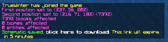
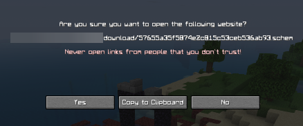

# ExportSchem

ExportSchem is a Spigot plugin that allows for exporting a WorldEdit clipboard to a downloadable schematic file.

## Configuration

The plugin must be configured before use. On the first startup, a config file will be generated. The comments in this file explain what each config option does.

**Important: You must have the ability to use additional ports. Contact your host if you are unsure what ports you can use.**

## Usage

Add something to your clipboard (by copying a selection or loading an existing schematic), then run `/exportschem`. This will give you a clickable link in chat.

## Commands

- `/exportschem`: As explained above
- `/exportschem about`: Gives information about the plugin
- `/exportschem reload`: Reloads the config

## Permissions

- `exportschem.command.exportschem`: Required to use `/exportschem`, enabled by default
- `exportschem.command.reload`: Required to use `/exportschem reload` 